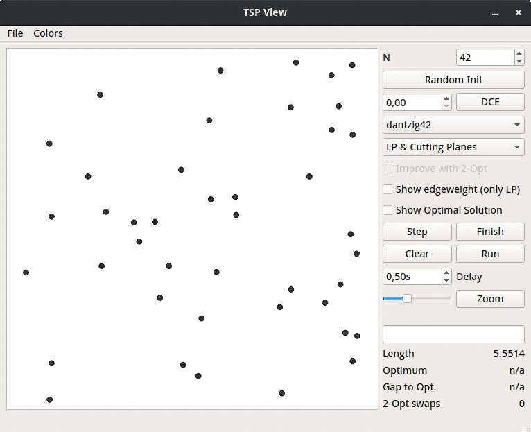

# :world_map: TSPview

This a rudimentary, stepwise viewer for a selection of heuristics to
approximate the Travelling Salesperson Problem (TSP).



## :whale: Docker

If you are running Linux and have an X server installed (probably true, XWayland does also work), it is easiest to use the provided docker container:

```bash
docker-compose build
X11AUTH=$(xauth list) docker-compose up
```

However, LP solving is disabled, since I can not ship the CPLEX library.

## :herb: Dependencies

* Python 3
* PyQt 5
* Concorde (optional, for optimal tours)
* boost::python (optional, for LP & Cutting Planes)
* CPLEX (optional, for LP & Cutting Planes)
